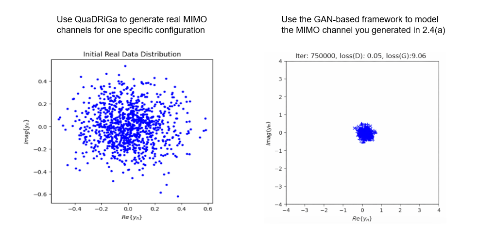

# Exercise 2.4: Channel GAN Implementation

This repository provides the starter code for Exercise 2.4. Your task is to implement the data generation function for a **Conditional Generative Adversarial Network (CGAN)** that simulates a Rayleigh fading channel. The goal is to learn the channel distribution without explicit channel state information (CSI).

## Experiment Setup

The script is set up to train a CGAN using a pre-generated dataset of channel coefficients:

*   **Dataset:** `rayleigh_channel_dataset.mat` (generated via QuaDRiGa)
*   **Model Architecture:** Conditional GAN (Generator + Discriminator)
*   **Input Dimension ($Z$):** 16 (Noise vector)
*   **Constructed Features:** Received Signal $y$, Conditioning Vector (Pilot/Label info)
*   **Training Steps:** 750,000 iterations

## Requirements
It must use Python = 3.7 !!!
```
pip install -r requirements.txt
```

## Run Exercise_2.4_starter.py
- Download  [QuaDRiGa_channel_generator.m](https://github.com/ZeinyLing/Artificial-Intelligence-Wireless/edit/main/HW-2-3/Ex2.4/QuaDRiGa_channel_generator.m) first
```
python Exercise_2.4_starter.py
```
## Results 

