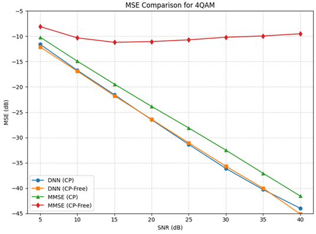

# Exercise 2.7: Data-Driven SISO-OFDM Channel Estimation

This repository provides the reference code for Exercise 2.7. Your task is to implement and evaluate channel estimators using both **DNN-based** and **LMMSE** methods for a SISO-OFDM system, and reproduce the simulation results demonstrating MSE performance (Figure 2.9).

## Experiment Setup
The scripts are configured to simulate the OFDM system with the following parameters:
* **Subcarriers $K$ :** 64
* **Pilot Symbol:** 1st OFDM symbol (64 QPSK-modulated pilot symbols)
* **Data Symbol:** 2nd OFDM symbol (64-QAM modulation)
* **SNR Range:** 5 dB to 40 dB (in 5 dB increments)
* **Channel Estimators:** DNN-based (multi-layer perceptron) and Linear Minimum Mean Square Error (LMMSE)
* **Scenarios:** With Cyclic Prefix (CP) for ideal conditions, and without CP to demonstrate inter-symbol interference.

## 🔗 Do the task on Colab
1. Upload tool folder
2. run ce_type = 'dnn'  , test_ce = False and CP_flag = True
3. run ce_type = 'dnn'  , test_ce = True  and CP_flag = True
4. run ce_type = 'mmse' , test_ce = True  and CP_flag = True
5. run ce_type = 'dnn'  , test_ce = False and CP_flag = False
6. run ce_type = 'dnn'  , test_ce = True  and CP_flag = False
7. run ce_type = 'mmse' , test_ce = True  and CP_flag = False
- [Exercise_2.7 (Colab)](https://colab.research.google.com/drive/1Q6h3fixTFr-etBfdxJaAgcRIjJ82T4y9?usp=sharing)

## Results

