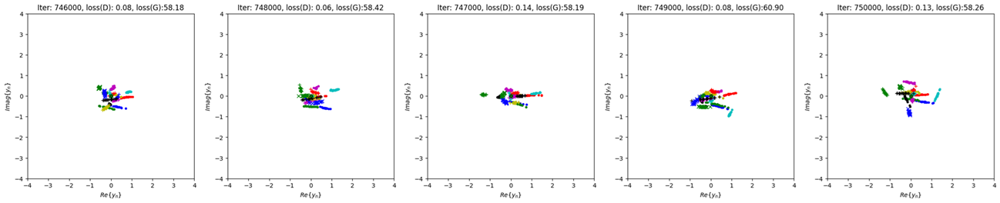

# HW-2

## Chapter 2  
Ex2.1 ~ Ex2.2, Ex2.4 （第三周作業）

### 🔗 Links
- [HW-2](https://github.com/ZeinyLing/Artificial-Intelligence-Wireless/blob/main/HW-1.2/314551087_HW-2.pdf)
- [Exercise_2.4_starter.py](https://github.com/ZeinyLing/Artificial-Intelligence-Wireless/blob/main/HW-2/Exercise_2.4_starter.py)
- [QuaDRiGa_channel_generator.m](https://github.com/ZeinyLing/Artificial-Intelligence-Wireless/blob/main/HW-2/QuaDRiGa_channel_generator.m)
- [rayleigh_channel_dataset.mat](https://github.com/ZeinyLing/Artificial-Intelligence-Wireless/blob/main/HW-2/rayleigh_channel_dataset.mat)
### 🔗 Run on Colab
- [Exercise_2.4_starter.py(Colab)](https://colab.research.google.com/drive/1a0k9C089eRybGK96N5pNZKZs-hkzSF8a?usp=sharing)
### 🔗 The results generated in the last 5000 iterations

