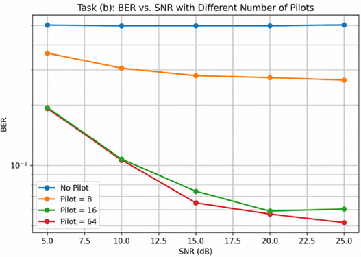
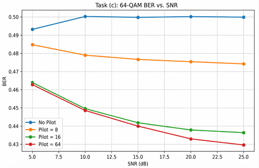
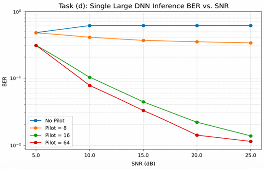

# Exercise 3.1: Learning-based Signal Detection for OFDM Systems

## Tasks

| Checklist | Details |
|-----------|---------|
| **Task (b)** | Open `main.py`. Implement a loop to iterate `config.SNR` from 5 to 25 dB. <br> Modify `config.Pilots` (e.g., 8, 16, 64) to evaluate the impact of **different pilot numbers**, and simulate a **no-pilot** scenario. Collect BER results to reproduce Figure 3.3. |
| **Task (c)** | Open `Train.py` and `Test.py` and change `mu = 6` for **64-QAM**. <br> Open `main.py` and change `config.pred_range = np.arange(48, 96)`. <br> Open `Train.py` and change the network output size to `n_output = 48`. |
| **Task (d)** | Revert to QPSK (`mu = 2`). Implement a **single large DNN**: <br> • Open `main.py` and set `config.pred_range = np.arange(0, 128)`. <br> • Open `Train.py` and set `n_output = 128`. <br> • Increase `n_hidden_1`, `n_hidden_2`, etc., in `Train.py` to give the network enough capacity. |
| **Run** | Execute: `python main.py` for each specific configuration. |
| **Observe** | The console will output the testing BER. You should manually record these values to plot BER vs. SNR curves and compare the performance differences in your report. |

## 快速使用說明

已經將Train跟Test整合成pytorch版本，並分成3個py檔案

* task_b.py
* task_c.py
* task_d.py

### Dependencies
Requirements
```bash
pip install -r requirements.txt
```
Root Folder
```bash
cd DNN_Detection
```

## Task (b)

```bash
python task_b.py

python inference_task_b.py
```

### Results



## Task (c)

```bash
python task_c.py

python inference_task_c.py
```

### Results



## Task (d)

```bash
python task_d.py

python inference_task_d.py
```

### Results


